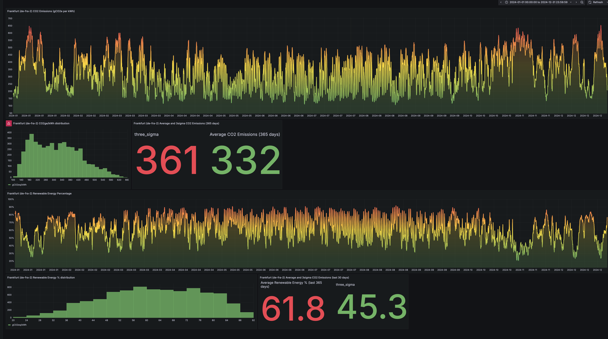

# Readme File 

# ElectricityMapsHistoricalYearlyData
Scripts to import historical datasets from Electricity Maps 
    

This repo contains the colleteral necessary to import historical data from Electricity Maps API. 

Electricity Maps publishes and releases data sets for zones and countries with hourly and daily data on CO2 emissions and % of renewable energy generated. 
The example here uses the dataset for Germany https://portal.electricitymaps.com/datasets/DE 

We can download any of these zones here and with the table below cross referencing for every current Linode production cloud deployment. 

This guide assumes you have deployed the Grafana/InfluxDB stack for emissions tracking here: https://github.com/Aka-JKiely/linodeco2intensitymonitoring 

| Location       | Country Code | Zone Name                          | Display Name   |
|----------------|--------------|------------------------------------|----------------|
| us-southeast   | US           | Southern Company Services          | US-SE-SOCO     |
| us-ord         | US           | PJM interconnection                | US-MIDA-PJM    |
| us-central     | US           | Electric Reliability Council of Texas | US-TEX-ERCO |
| us-west        | US           | California ISO                     | US-CAL-CISO    |
| us-lax         | US           | California ISO                     | US-CAL-CISO    |
| us-mia         | US           | City of Homestead                  | US-FLA-HST     |
| us-east        | US           | PJM interconnection                | US-MIDA-PJM    |
| us-sea         | US           | Puget Sound Energy                 | US-NW-PSEI     |
| us-iad         | US           | PJM interconnection                | US-MIDA-PJM    |
| ca-central     | CA           | Ontario                            | CA-ON          |
| nl-ams         | NL           | Netherlands                        | NL             |
| it-mil         | IT           | Central North Italy                | IT-CNO         |
| eu-west        | UK           | Great Britain                      | GB             |
| gb-lon         | UK           | Great Britain                      | GB             |
| fr-par         | FR           | France                             | FR             |
| es-mad         | ES           | Spain                              | ES             |
| eu-central     | DE           | Germany                            | DE             |
| de-fra-2       | DE           | Germany                            | DE             |
| se-sto         | SE           | South Central Sweden               | SE-SE3         |
| sg-sin-2       | SG           | Singapore                          | SG             |
| jp-osa         | JP           | Kansai                             | JP-KN          |
| ap-northeast   | JP           | Tokyo                              | JP-TK          |
| jp-tyo-3       | JP           | Tokyo                              | JP-TK          |
| in-maa         | IN           | Southern India                     | IN-SO          |
| in-bom-2       | IN           | Western India                      | IN-WE          |
| id-cgk         | ID           | Indonesia                          | ID             |
| br-gru         | BR           | South Brazil                       | BR-S           |
| ap-southeast   | AU           | New South Wales                    | AU-NSW         |
| au-mel         | AU           | Victoria                           | AU-VIC         |

## How to Deploy 

1. This guide assumes you have already built the Grafana/InflxuDB instance documented here: https://github.com/Aka-JKiely/linodeco2intensitymonitoring 
2. Go to ElectricityMaps website and download the historical dataset for a zone/country, in this example we are going to use Germany for the grid information as it applies to Linode Frankfurt Data centre. Download the hourly dataset from here https://portal.electricitymaps.com/datasets/DE
3. Copy across the dataset file downloaded from Electricity Maps to the Linode where the Grafana/InfluxDB stack is running in to the scripts directory /scripts/co2intensitymonitoring/DE_2024_hourly.csv
4. Copy across the bash script in the respository here called emaps_historical_hourly_data_mod.sh which formats the csv file in to the correct format before inporting in to InfluxDB
5. Run the modifcation script on the original historical hourly dataset like this:
   ./emaps_historical_hourly_data_mod.sh DE_2024_hourly.csv DE_2024_hourly_mod.csv
7. Next setup influxDB config on the cli with this command, add your InfluxDB token in to the --token placeholder "INSERT_INFLUXDB_TOKEN_HERE"
   influx config create --config-name default   --host-url http://localhost:8086   --org Akamai   --token INSERT_INFLUXDB_TOKEN_HERE   --active
8. Next use the InfluxDB write command to import the modified csv file in to the existing bucket, in this example we are using de-fra-2 (Frankfurt) location
   influx write --bucket de-fra-2 --file DE_2024_hourly_mod.csv
9. Next go to the Grafana Dashboard and import the example dashboard here in this repo https://github.com/Aka-JKiely/ElectricityMapsHistoricalYearlyData/blob/main/CO2emissionshistoricaldata_DE_2024.json
   Modify as required if a different zone/country is being used or if a different year is being imported. 

   You should see a dashboard like this 
   CO2Emissions_DE_2024_Sample.png
   

## Some known limitations 

No known limitations, tested as of Jan 31st 2025 with 2024 and 2023 datasets, emaps may change file formats. 

